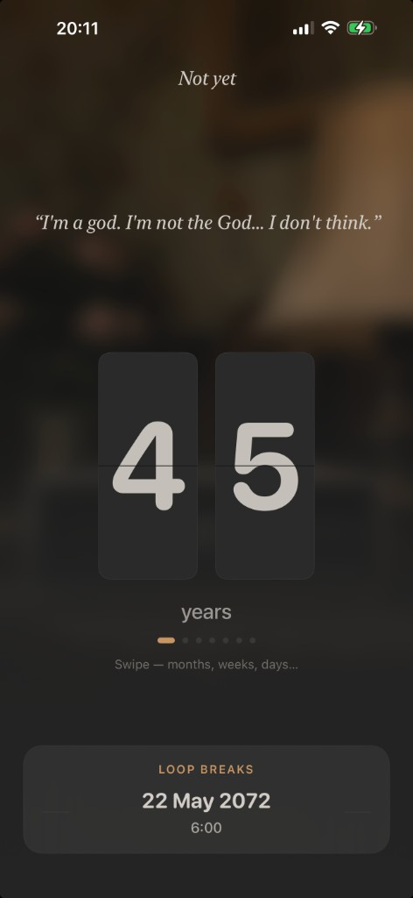
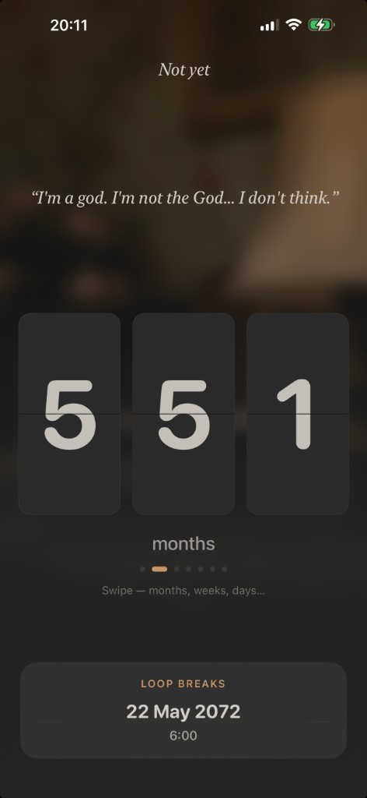
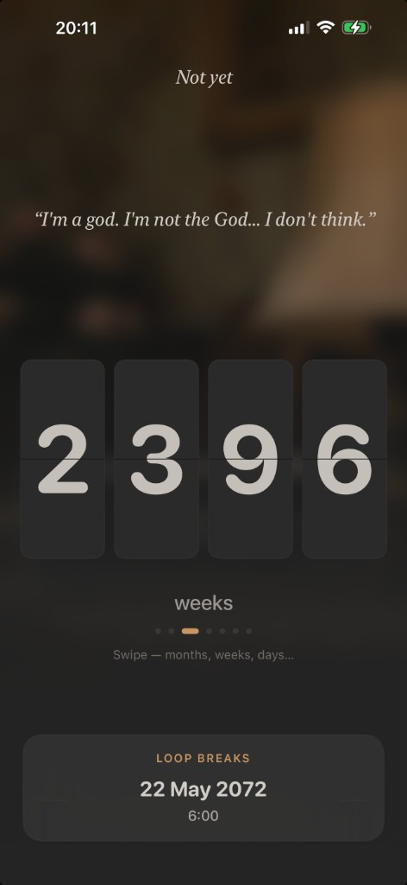

# Groundhog Day

A personal iOS countdown app with a flip-clock UI and a Groundhog Day mood. Pick a future date, then swipe through years, months, weeks, days, hours, minutes, and seconds on split-flap tiles.

**Bundle ID:** `com.vil4max.groundhogday`  
**Languages:** English, Russian, Ukrainian  
**Minimum:** iOS 17

## Screenshots

| Years | Months | Weeks |
| --- | --- | --- |
|  |  |  |

## What it does

- **Onboarding** — optional label, graphical date picker (up to 99 years ahead, default 6:00), notification permission sheet with context
- **Countdown** — horizontal carousel across 7 units; each page shows the full interval in that unit (e.g. 551 months, not 45y + 11m)
- **Groundhog Day quotes** — random movie line on each app launch, serif typography
- **Split-flap digits** — top half falls, bottom half rises in one motion; light haptic when rows settle on open
- **Loop breaks** — event date in a bottom card; tap to open settings (no toolbar calendar button)
- **Background** — blurred launch-screen clock image with a soft gradient overlay
- **Notifications** — daily 6:00 reminder and one-shot at event time; rescheduled on launch and foreground
- **Settings** — label, date, notification toggles, custom reminder copy
- **Accessibility** — Reduce Motion simplifies flip animation; VoiceOver labels on tiles and quotes
- **iCloud** — sync code is in place but **disabled** until a paid Apple Developer account

## Tech

- SwiftUI, `@Observable`, Swift Concurrency (no Combine)
- `CountdownCalculator` — interval math + unit tests
- `EventDateStorage` — `UserDefaults` + optional `NSUbiquitousKeyValueStore`
- Xcode project: `ios/GroundhogDay.xcodeproj`

## Project layout

```
ios/
├── GroundhogDay.xcodeproj
├── GroundhogDay/
│   ├── Features/Countdown/   # Flip tiles, carousel, main screen
│   ├── Features/Settings/
│   ├── Features/Onboarding/
│   ├── Services/
│   ├── Models/
│   └── Resources/
└── GroundhogDayTests/
```

## Build

```bash
cd ios
xcodebuild -project GroundhogDay.xcodeproj -scheme GroundhogDay \
  -destination 'platform=iOS Simulator,name=iPhone 17' build test
```

## Enable iCloud sync (later)

1. Enroll in the [Apple Developer Program](https://developer.apple.com/programs/).
2. Xcode → **GroundhogDay** → Signing & Capabilities → **iCloud** → **Key-value storage**.
3. Use `GroundhogDay.entitlements.icloud` for ubiquity identifier.
4. Set `FeatureFlags.iCloudSyncEnabled = true` in `Config/FeatureFlags.swift`.
5. Verify on two devices with the same Apple ID.

Until then, data stays in local `UserDefaults` only.

## License

See [LICENSE](LICENSE).
